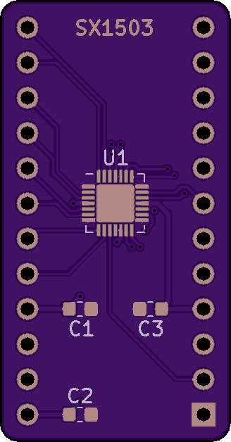

# SX1503-Breakout

A breakout board for the Semtech i2c GPIO expander. The SX1503 is an i2c GPIO expander with support for 16 extra pins, 2 voltage translation banks, and a simple PLD capability.

#### [Hackaday.io Page](https://hackaday.io/project/168368-sx1503-breakout)

#### [Order from Tindie](https://www.tindie.com/products/18522/)

------------------------

### What is in this repository:

**./doc**:  Location for documentation

**./KiCAD**:  Hardware design files

**./Arduino**:  Arduino driver

------------------------

### Notes on driver features:

#### Optional pins

The reset pin is optional and must be tied high with a pullup resistor if not
under software control, since the part is capable of pulling it low to indicate
its state.
The IRQ pin is also optional, and should be left floating if not used.
Despite both being optional, both must be passed as arguments to the
constructor. If you have left the pins disconnected, pass 255 for that pin, and
the class will behave in a manner to accommodate it (at the cost of time and
complexity in the driver).

#### Preserve-on-destroy

When the driver instance is destroyed, the default behavior is to
put the hardware into a known state (reset). This reverts all GPIO pins to
inputs and disconnects all the pullup/down resistors. Use-cases that want the
hardware state to outlive the driver's life cycle are possible by
setting preserveOnDestroy(true) ahead of `init()`, like so...

    // Class initializes with the existing state of the hardware.
    sx1503.preserveOnDestroy(true);
    sx1503.init(&Wire);

Since `init()` will also call `reset()` by default, preserveOnDestroy must be
enabled prior to `init()` to achieve the desired result (both sides of the driver life cycle).

#### Preserving and restoring hardware states

The driver provides a means of cloning prior states to and from a buffer.
Possible reasons for doing this might be...

  * Higher bus efficiency during `init()`.
  * Major code savings, since you can skip configuring the hardware and the class with discrete function calls.

Saving the current state can be done like this (from the example sketch)...

    uint8_t buf[SX1503_SERIALIZE_SIZE];
    uint8_t written = sx1503.serialize(buf, SX1503_SERIALIZE_SIZE);
    if (SX1503_SERIALIZE_SIZE == written) {
      // Everything worked. Do what you will with the buffer.
    }

Restoring the state from a buffer can be done either upon construction...

    uint8_t buf[36] = {
      0x01, 0x0E, 0x0F, 0x00, 0x00, 0x04, 0x0F, 0xFF, 0xF0, 0x04, 0x04, 0x08,
      0x08, 0xF0, 0xFF, 0xFF, 0xFF, 0xFF, 0xFF, 0x00, 0x00, 0x00, 0x00, 0x00,
      0x00, 0x00, 0x00, 0x00, 0x00, 0x00, 0x00, 0x00, 0x00, 0x00, 0x00, 0x02
    };
    SX1503 sx1503(buf, 36);

...or after a successful `init()`...

    // Literally anywhere in the sketch...
    sx1503.unserialize(buf, 36);

If done by construction, the configuration will be written to the class immediately,
and to the hardware during `init()`.

Invocation of `unserialize()` will immediately result in I/O as the new
configuration is imparted, but the fields (if any) that are otherwise required for
construction will be ignored.

------------------------

Front | Back
:-------:|:------:
  | 

